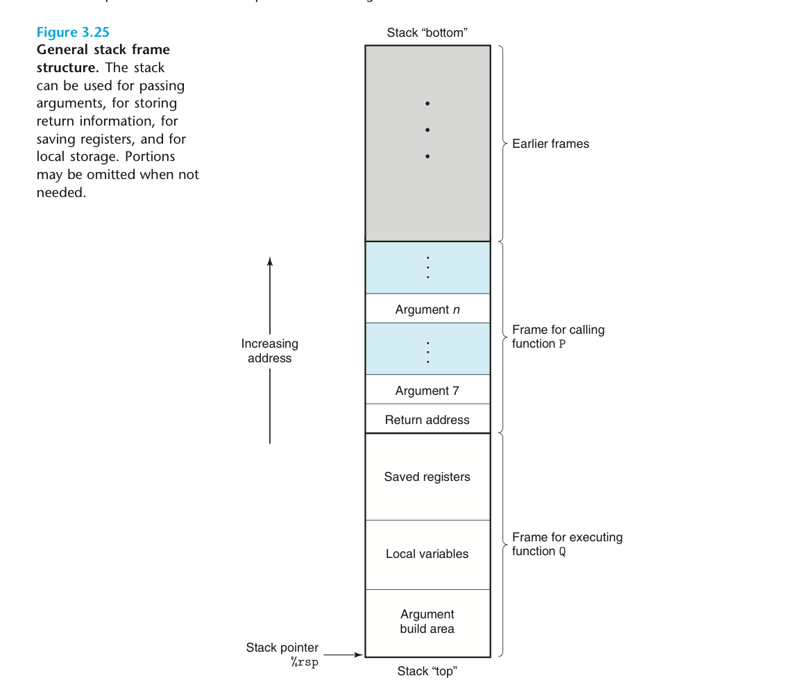

# <center> Chapter 3 Machine-Level Representation of Programs

**new words:**

malware:
infest:
nuance:
deluding:
peculiar:
compatibility:
arcane:
colloquially:
operand: 操作数
## 3.1 A Historical Perspective

## 3.2 Program Encoding
<font size =4.5 face="Consolas">

just remember some commands:
```shell
linux> gcc -Og -S mstore.c
```
generate assembly code from source code
```shell
linux> gcc -Og -c mstore.c
```
generate machine code from source code
```shell
linux> objdump -d mstore.c
linux> objdump -d prog
```
generate assembly code using disassemblers

</font>

## 3.3 Data Formats
|C declaraion|Intel data type|Assembly-code suffix|Size(bytes)|
|-|-|-|-|
|char|Byte|b|1|
|short|Word|w|2|
|int|Double word|l|4|
|long|Quad word|q|8|
|char *(pointer)|Quad word|q|8|
|float|Single precision|s|4|
|double|Double precision|l|8|


## 3.4 Accessing information
### 3.4.1 Operand Specifiers

|Type |Form|Operand value|Name|
|-|-|-|-
|Immediate|$$Imm$|$Imm$|Immediate|
|Register|$r_a$|R[$r_a$]|Register
|Memory(<font color ="red">General</font>)|$Imm(r_b,r_i,s)$|M[$Imm+R[r_b]+R[r_i]·s$]|Scaled indexed|

### 3.4.2 Data Movement Instructions

|Instruction|Effect|Description|
|-|-|-|
|MOV  *S,D*|$D <<S$|Move
|movb||Move byte|
|movw||Move word|
|movl||Move double word|
|movq||Move quad word(only 32-bit two's-complement number)|
|movabsq *I,R*|$R<<I$|Move absolute quad word|

</br>

**Zero-extending data movement instructions:**
<font size=2>
|Instruction|Effect|Description|
|-|-|-|
|MOVZ  *S,R*|$R << ZeroExtend(S)$|Move with zero extension|
|movzbw||Move zero-extended byte to word|
|movzbl||Move zero-extended byte to double word|
|movzwl||Move zero-extended word to double word|
|movzbq||Move zero-extended byte to quad word|
|movzwq||Move zero-extended word to quad word|
</font>

**Sign-extending data movement instructions:**
<font size=2>
|Instruction|Effect|Description|
|-|-|-|
|MOVS  *S,R*|$R << SignExtend(S)$|Move with sign extension|
|movsbw||Move sign-extended byte to word|
|movsbl||Move sign-extended byte to double word|
|movswl||Move sign-extended word to double word|
|movsbq||Move sign-extended byte to quad word|
|movswq||Move sign-extended word to quad word|
|movslq||Move sign-extended double word to quad word|
|cltq|$%rax<< SignExtend(%eax)$|sign-extend %eax to %rax|
</font>
 
 ### 3.4.4 Pushing and Poping Stack Data

|Instruction|Effect|Description|
|-|-|-|
|pushq *S*|R[%rsp]<<R[%rsp]-8 M[R[%rsp]]<<S|Push quad word|
|popq *D*|D<<M[R[%rsp]] R[%rsp]<<R[%rsp]-+8|Pop quad word|

## 3.5 Arithmetic and Logical Operations
|Instruction|Effect|Description|
|-|-|-|
|leaq S,D|D<<&S|Load effective address|
|INC D|D<<D+1|Increment|
|DEC D|D<<D-1|Decrement|
|NEG D|D<< $- $D|Negate|
|NOT D|D<<~D|Complement|

|Instruction|Effect|Description|
|-|-|-|
|ADD S,D|D<<D+S|Add|
|SUB S,D|D<<D-S|Subtract|
|IMUL S,D|D<<D*S|Multiply|
|XOR S,D|D<<D ^ S|Exclusive-or|
|OR S,D|D<<S \| D|Or|
|AND S,D|D<<D&S|And|

|Instruction|Effect|Description|
|-|-|-|
|SAL(SHL) k,D|$D=D<<k$|Left shift|
|SAR k,D|$D=D>>_Ak$|Arithmetic right shift|
|SHR k,D|$D=D >>_L k$|Logical right shift|

**Special Arithmetic Operations:**
|Instruction|Effect|Description|
|-|-|-|
|imulq S|R[%rdx]:R[%rax]<<S $\times$ R[%rax]|Signed full multiply|
|mulq S|R[%rdx]:R[%rax]<<S $\times$ R[%rax]|Unsigned full multiply|
|cqto|R[%rdx]:R[%rax]<<SignExtend(R[%rax])|Convert to oct word|
|idivq S|R[%rdx]<<R[%rdx]:R[%rax] mod S</BR>R[%rax]<<R[%rdx]:R[%rax] $\div$S|Signed divide|
|divq S|R[%rdx]<<R[%rdx]:R[%rax] mod S</BR>R[%rax]<<R[%rdx]:R[%rax] $\div$S|Unsigned divide|

## 3.6 Control
<font size =4.5 face="Consolas">
The instructions of control part is too many and typing them out here is too difficult for me.
</br>
Just take the book as reference.</br>

* Condition codes
* Jump Instructions
* Loop
* Switch

</font>

## 3.7 Procedures
<font size =4.5 face="Consolas">
Consider that procedure P calls procedure Q, and Q then executes and returns back to P.

* Passing control
* Passing data
* Allocating and deallocating memory

</font>

### 3.7.1 The Run-Time Stack



### 3.7.2 Control Transfer

|Instruction|Description|
|:-:|-|
|**call** *Label*|Procedure call (direct)|
|**call** **Operand*|Procedure call (indirect)|
|**ret**|Return from call|

### 3.7.3 Data Transfer

**through register**: 1 %rdi 2 %rsi 3 %rdx 4 %rcx 5 %r8 6 %r9
**through stack**: Argument build area

### 3.7.4-3.7.5 Local Storage in Stack/Register

### 3.7.6 Recursive Procedures

<center>The code for these three chapters is good.

**JUST READ IT.**</center>

## 3.8 Array Allocation and Acess
<font size =4.5 face="Consolas">

**Array in C:**

* aggregate scalar data into larger data types.
  
* can generate pointers to elements within arrays and perform arithmetic with these pointers

</font>

### 3.8.1 Basic Principle
***T***  A[$N$]         

***T***:one data type.
N:length of array.
A:a pointer to the beginning of the array.

### 3.8.2 Pointer Arithmetic
p:$x_p$ 
p+i:$x_p+L·i$ 

## 3.9 Heterogeneous Data Structures
<font size =4.5 face="Consolas">

* **struct**:different fileds reference different blocks of memory
* **union**:all reference the same block

**Data Alignment:**
|**K**|Types|
|-|-|
|1|char|
|2|short|
|4|int, float|
|8|long, double, char *

The **struct** must satisfy 8-byte alignment requirement. 
</font>

## 3.10 Combining Control and Data in Machine-Level Programs

### 3.10.1 Understanding Pointers
<font size =4.5 face="Consolas">

* *Every pointer has an associated type.*
* *Every pointer has a value.*
* *Pointers are created with the '&' operator.*
* *Pointers are derefernced with the "\*" operator.*
* *Arrays and pointers are closely related.*
* *Casting from one type of pointer to another changes its type but not its value.*
* *Pointer can also point to functions.*
```c
int fun(int x,int *p);
int (*fp)(int,int *);
fp =fun;
```
</font>

### 3.10.2 Life in the Real World:Using the *GDB* Debugger


### 3.10.3 Out-of-Bounds Memory References and Buffer Overflow


### 3.10.4 Thwarting Buffer Overflow Attacks
<font size =4.5 face="Consolas">

* Stack Randomization
* Stack Corruption Detection
* Limiting Executable Code Regions

</font>

### 3.10.5 Supporting Variable-Size Stack Frame


## 3.11 Floating-Point Data
<font size =4.5 face="Consolas">

* How floating-point values are stored and accessed. This is typically via some form of registers.
* The instructions that operate on floating-point data.
* The conventions used for passing floating point values as arguments to functions and for returning them as results.
* The conventions for how registers are preserved during calls——for example, with some registers designated as caller saved,and others as callee saved.


</font> 
